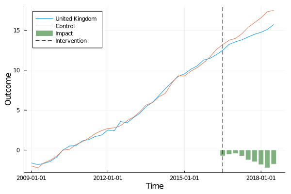

# SynthControl.jl
Julia package for synthetic control methods, implementing the technique described in [Abadie et al. (2010)](https://economics.mit.edu/files/11859)

The package is at alpha stage - there's a bare bones implementation that can be used to obtain results and plot them, as well as an implementation of a placebo test, but no formal inference.

## Installation

The package is currently unregistered, installation therefore works directly
from the repo:

```
pkg> add "https://github.com/nilshg/SynthControl.jl"
```

## Usage

The package includes example data borrowed from the [CER Brexit study](
  https://www.cer.eu/insights/cost-brexit-june-2018):

```
julia> df = load_brexit()
897×3 DataFrame
│ Row │ country        │ quarter    │ realgdp │
│     │ String         │ Date       │ Float64 │
├─────┼────────────────┼────────────┼─────────┤
│ 1   │ Australia      │ 2009-01-01 │ 1.04    │
│ 2   │ Austria        │ 2009-01-01 │ -1.53   │
│ 3   │ Belgium        │ 2009-01-01 │ -1.15   │
⋮
│ 894 │ Sweden         │ 2018-07-01 │ 22.48   │
│ 895 │ Switzerland    │ 2018-07-01 │ 14.35   │
│ 896 │ United Kingdom │ 2018-07-01 │ 15.72   │
│ 897 │ United States  │ 2018-07-01 │ 19.32   │
```

The package defines a `SynthControlModel` type, instances of which can be constructed
from a `DataFrame`, specifying the column holding the outcome variable of interest,
the time and group (ID) dimension, the treatment start period and the treated
group/observation. Currently, only one treatment unit can be specified.

The example data set includes quarterly GDP for a number of OECD countries, and
we are interested in estimating the impact of the Brexit vote in Q2 2016 on GDP
in the UK:

```
julia> s_model = SynthControlModel(df, :realgdp, :country, :quarter, "United Kingdom", Date(2016, 7, 1))

Synthetic Control Model
    Outcome variable: realgdp
    Time dimension: quarter with 39 unique values
    Treatment period: 2016-07-01
    ID variable: country with 23 unique values
    Treatment ID: United Kingdom

    Model is not fitted
```

The output indicates that the model is not fitted, that is we have at this stage
only defined the basic model structure. We can fit the model using the `fit!`
function, which will modify our `SynthControlModel` in place:

```
julia> fit!(s_model)

Synthetic Control Model
    Outcome variable: realgdp
    Time dimension: quarter with 39 unique values
    Treatment period: 2016-07-01
    ID variable: country with 23 unique values
    Treatment ID: United Kingdom
    Model is fitted
    Impact estimates: [-0.712, -0.525, -0.426, -0.753, -1.218, -1.451, -1.816, -2.223, -1.761]
```

The reported impact estimates are the difference between observed outcome variable
and estimated outcome in the absence of treatment - a negative value therefore means
the treatment is expected to have reduced the outcome variable compared to the
counterfactual.

The package also defines a [plot recipe](https://github.com/JuliaPlots/RecipesBase.jl)
which allows to visualise the estimated impact:

```
julia> using Plots

julia> plot(s_model)
```


To do:
* Inference
* Matching on specific covariates
* Multiple treatment units
* Documentation
* Expand testset
* Consider dropping DataFrames dependency in favour of Tables
* Include [Augmented Synthetic Control](https://eml.berkeley.edu/~jrothst/workingpapers/BMFR_Synth_Nov_2018.pdf)
